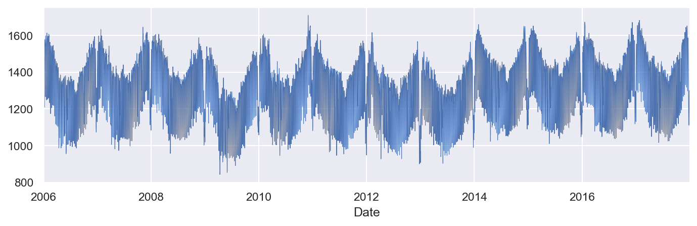
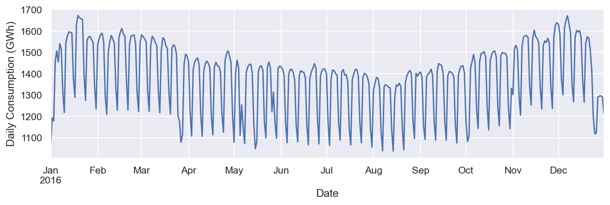
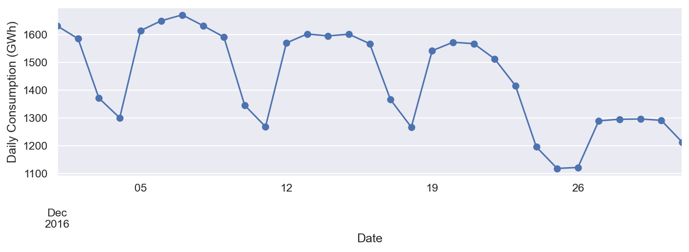
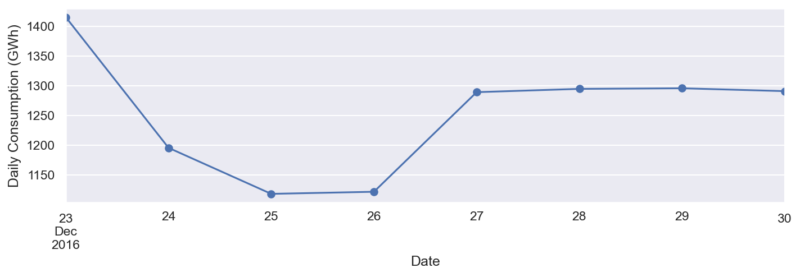
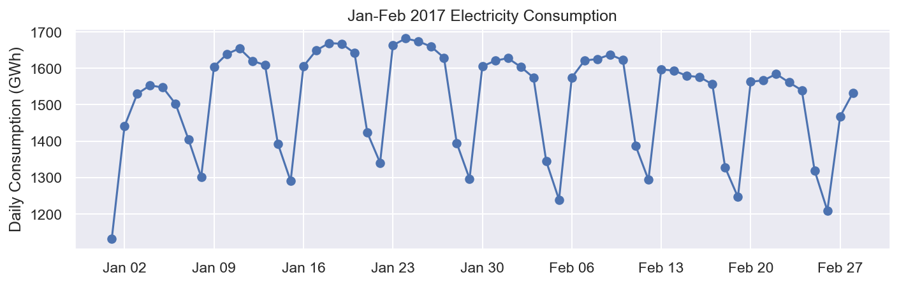
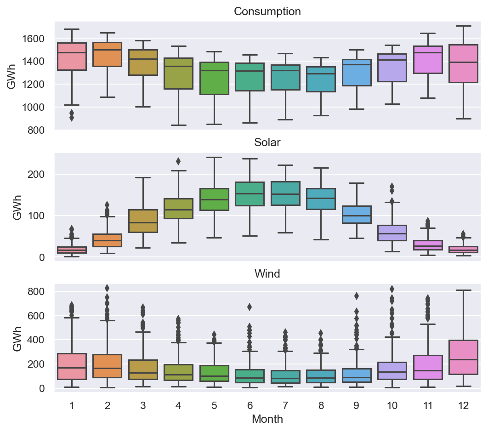
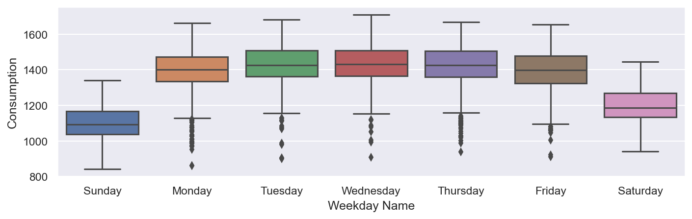
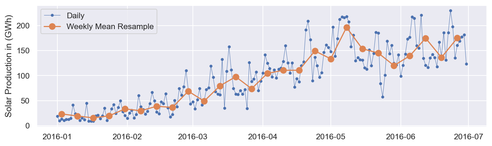

# Open Power System Data para comprender la TSA

En esta sección, utilizaremos Open Power System Data para comprender la TSA. Veremos las estructuras de datos de series de tiempo, la indexación basada en el tiempo y varias formas de visualizar datos de series de tiempo.


```python
import pandas as pd
```


```python
# load time series dataset
df = pd.read_csv("https://raw.githubusercontent.com/jenfly/opsd/master/opsd_germany_daily.csv")
df.info()
```

    <class 'pandas.core.frame.DataFrame'>
    RangeIndex: 4383 entries, 0 to 4382
    Data columns (total 5 columns):
     #   Column       Non-Null Count  Dtype  
    ---  ------       --------------  -----  
     0   Date         4383 non-null   object 
     1   Consumption  4383 non-null   float64
     2   Wind         2920 non-null   float64
     3   Solar        2188 non-null   float64
     4   Wind+Solar   2187 non-null   float64
    dtypes: float64(4), object(1)
    memory usage: 171.3+ KB
    

Las columnas del marco de datos se describen aquí :

- `Date` : La fecha está en el formato yyyy-mm-dd.
- `Consumption` : Indica el consumo eléctrico en GWh.
- `Wind`: Indica la producción de energía eolica en GWh.
- `Solar` : Indica la producción de energía solar en GWh.
- `Wind+Solar` : Representa la suma de la producción de energía solar y eólica en GWh.

## Data Transformation

Verificar los tipos de datos del conjunto de datos:


```python
df.dtypes
```


    Date            object
    Consumption    float64
    Wind           float64
    Solar          float64
    Wind+Solar     float64
    dtype: object


La Variable Date es de tipo `Object` y se debe convertir a formato `DateTime`


```python
df['Date'] = pd.to_datetime(df['Date'])
```


```python
# verificando
df.dtypes
```


    Date           datetime64[ns]
    Consumption           float64
    Wind                  float64
    Solar                 float64
    Wind+Solar            float64
    dtype: object


## Convertir Date en el Indice del Dataframe:

Utilizarás los valores de esta columna como índices de las filas en lugar de los índices numéricos predeterminados de Pandas.


```python
df.set_index('Date', inplace=True)
df.tail(5)
```


<div>
<style scoped>
    .dataframe tbody tr th:only-of-type {
        vertical-align: middle;
    }

    .dataframe tbody tr th {
        vertical-align: top;
    }

    .dataframe thead th {
        text-align: right;
    }
</style>
<table border="1" class="dataframe">
  <thead>
    <tr style="text-align: right;">
      <th></th>
      <th>Consumption</th>
      <th>Wind</th>
      <th>Solar</th>
      <th>Wind+Solar</th>
    </tr>
    <tr>
      <th>Date</th>
      <th></th>
      <th></th>
      <th></th>
      <th></th>
    </tr>
  </thead>
  <tbody>
    <tr>
      <th>2017-12-27</th>
      <td>1263.94091</td>
      <td>394.507</td>
      <td>16.530</td>
      <td>411.037</td>
    </tr>
    <tr>
      <th>2017-12-28</th>
      <td>1299.86398</td>
      <td>506.424</td>
      <td>14.162</td>
      <td>520.586</td>
    </tr>
    <tr>
      <th>2017-12-29</th>
      <td>1295.08753</td>
      <td>584.277</td>
      <td>29.854</td>
      <td>614.131</td>
    </tr>
    <tr>
      <th>2017-12-30</th>
      <td>1215.44897</td>
      <td>721.247</td>
      <td>7.467</td>
      <td>728.714</td>
    </tr>
    <tr>
      <th>2017-12-31</th>
      <td>1107.11488</td>
      <td>721.176</td>
      <td>19.980</td>
      <td>741.156</td>
    </tr>
  </tbody>
</table>
</div>


Agreguemos más columnas a nuestro marco de datos para faciltar el analisis. Agregemos `Year`, `Month` y `Weekday Name`:


```python
df['Year'] = df.index.year
df['Month'] = df.index.month
df['Weekday Name'] = df.index.day_name()
```


```python
df.sample(5)
```


<div>
<style scoped>
    .dataframe tbody tr th:only-of-type {
        vertical-align: middle;
    }

    .dataframe tbody tr th {
        vertical-align: top;
    }

    .dataframe thead th {
        text-align: right;
    }
</style>
<table border="1" class="dataframe">
  <thead>
    <tr style="text-align: right;">
      <th></th>
      <th>Consumption</th>
      <th>Wind</th>
      <th>Solar</th>
      <th>Wind+Solar</th>
      <th>Year</th>
      <th>Month</th>
      <th>Weekday Name</th>
    </tr>
    <tr>
      <th>Date</th>
      <th></th>
      <th></th>
      <th></th>
      <th></th>
      <th></th>
      <th></th>
      <th></th>
    </tr>
  </thead>
  <tbody>
    <tr>
      <th>2006-05-09</th>
      <td>1353.229</td>
      <td>NaN</td>
      <td>NaN</td>
      <td>NaN</td>
      <td>2006</td>
      <td>5</td>
      <td>Tuesday</td>
    </tr>
    <tr>
      <th>2007-01-09</th>
      <td>1554.889</td>
      <td>NaN</td>
      <td>NaN</td>
      <td>NaN</td>
      <td>2007</td>
      <td>1</td>
      <td>Tuesday</td>
    </tr>
    <tr>
      <th>2010-02-04</th>
      <td>1521.671</td>
      <td>82.257</td>
      <td>NaN</td>
      <td>NaN</td>
      <td>2010</td>
      <td>2</td>
      <td>Thursday</td>
    </tr>
    <tr>
      <th>2016-07-06</th>
      <td>1413.597</td>
      <td>430.530</td>
      <td>182.117</td>
      <td>612.647</td>
      <td>2016</td>
      <td>7</td>
      <td>Wednesday</td>
    </tr>
    <tr>
      <th>2016-01-25</th>
      <td>1556.816</td>
      <td>306.528</td>
      <td>33.782</td>
      <td>340.310</td>
      <td>2016</td>
      <td>1</td>
      <td>Monday</td>
    </tr>
  </tbody>
</table>
</div>


### Indexación basada en el tiempo

Tener una indexación basada en el tiempo permite utilizar una cadena formateada para seleccionar datos.


```python
df.loc['2015-02-23']
```


    Consumption     1592.656
    Wind             365.763
    Solar             28.046
    Wind+Solar       393.809
    Year                2015
    Month                  2
    Weekday Name      Monday
    Name: 2015-02-23 00:00:00, dtype: object


```python
df.loc['2017-01-01':'2017-12-30']
```


<div>
<style scoped>
    .dataframe tbody tr th:only-of-type {
        vertical-align: middle;
    }

    .dataframe tbody tr th {
        vertical-align: top;
    }

    .dataframe thead th {
        text-align: right;
    }
</style>
<table border="1" class="dataframe">
  <thead>
    <tr style="text-align: right;">
      <th></th>
      <th>Consumption</th>
      <th>Wind</th>
      <th>Solar</th>
      <th>Wind+Solar</th>
      <th>Year</th>
      <th>Month</th>
      <th>Weekday Name</th>
    </tr>
    <tr>
      <th>Date</th>
      <th></th>
      <th></th>
      <th></th>
      <th></th>
      <th></th>
      <th></th>
      <th></th>
    </tr>
  </thead>
  <tbody>
    <tr>
      <th>2017-01-01</th>
      <td>1130.41300</td>
      <td>307.125</td>
      <td>35.291</td>
      <td>342.416</td>
      <td>2017</td>
      <td>1</td>
      <td>Sunday</td>
    </tr>
    <tr>
      <th>2017-01-02</th>
      <td>1441.05200</td>
      <td>295.099</td>
      <td>12.479</td>
      <td>307.578</td>
      <td>2017</td>
      <td>1</td>
      <td>Monday</td>
    </tr>
    <tr>
      <th>2017-01-03</th>
      <td>1529.99000</td>
      <td>666.173</td>
      <td>9.351</td>
      <td>675.524</td>
      <td>2017</td>
      <td>1</td>
      <td>Tuesday</td>
    </tr>
    <tr>
      <th>2017-01-04</th>
      <td>1553.08300</td>
      <td>686.578</td>
      <td>12.814</td>
      <td>699.392</td>
      <td>2017</td>
      <td>1</td>
      <td>Wednesday</td>
    </tr>
    <tr>
      <th>2017-01-05</th>
      <td>1547.23800</td>
      <td>261.758</td>
      <td>20.797</td>
      <td>282.555</td>
      <td>2017</td>
      <td>1</td>
      <td>Thursday</td>
    </tr>
    <tr>
      <th>...</th>
      <td>...</td>
      <td>...</td>
      <td>...</td>
      <td>...</td>
      <td>...</td>
      <td>...</td>
      <td>...</td>
    </tr>
    <tr>
      <th>2017-12-26</th>
      <td>1130.11683</td>
      <td>717.453</td>
      <td>30.923</td>
      <td>748.376</td>
      <td>2017</td>
      <td>12</td>
      <td>Tuesday</td>
    </tr>
    <tr>
      <th>2017-12-27</th>
      <td>1263.94091</td>
      <td>394.507</td>
      <td>16.530</td>
      <td>411.037</td>
      <td>2017</td>
      <td>12</td>
      <td>Wednesday</td>
    </tr>
    <tr>
      <th>2017-12-28</th>
      <td>1299.86398</td>
      <td>506.424</td>
      <td>14.162</td>
      <td>520.586</td>
      <td>2017</td>
      <td>12</td>
      <td>Thursday</td>
    </tr>
    <tr>
      <th>2017-12-29</th>
      <td>1295.08753</td>
      <td>584.277</td>
      <td>29.854</td>
      <td>614.131</td>
      <td>2017</td>
      <td>12</td>
      <td>Friday</td>
    </tr>
    <tr>
      <th>2017-12-30</th>
      <td>1215.44897</td>
      <td>721.247</td>
      <td>7.467</td>
      <td>728.714</td>
      <td>2017</td>
      <td>12</td>
      <td>Saturday</td>
    </tr>
  </tbody>
</table>
<p>364 rows × 7 columns</p>
</div>


## Visualizacion de Series Temporales


```python
import matplotlib.pyplot as plt
import seaborn as sns
```

Configurar el tamaño y la resolución de las figuras generadas en los gráficos.


```python
sns.set(rc={'figure.figsize':(11, 3)})
plt.rcParams['figure.figsize'] = (11,3)
plt.rcParams['figure.dpi'] = 150
```

Gráfico lineal de la serie temporal completa del consumo eléctrico diario

El eje y muestra el consumo de electricidad y el eje x muestra el año. Sin embargo, hay demasiados conjuntos de datos para cubrir todos los años.


```python
df['Consumption'].plot(linewidth=0.5)
```


    <Axes: xlabel='Date'>


    

    


Usemos los puntos para trazar los datos de todas las demás columnas:


```python
cols_to_plot = ['Consumption', 'Solar', 'Wind']
axes = df[cols_to_plot].plot(marker='.', alpha=0.5, linestyle='None',figsize=(14, 6), subplots=True)
for ax in axes:
    ax.set_ylabel('Daily Totals (GWh)')
```


    

    


El resultado muestra que el consumo de electricidad se puede dividir en dos patrones distintos:

- Un grupo de aproximadamente 1.400 GWh y más
- Otro grupo aproximadamente por debajo de los 1.400 GWh

Podemos investigar más a fondo un solo año para verlo más de cerca. Verifique el código proporcionado aquí :


```python
ax = df.loc['2016', 'Consumption'].plot()
ax.set_ylabel('Daily Consumption (GWh)');
```


    

    


Podemos ver claramente el consumo de electricidad para 2016. El gráfico muestra una disminución drástica en el consumo de electricidad a finales de año (diciembre) y durante agosto. Podemos buscar más detalles en cualquier mes en particular. Examinemos el mes de diciembre de 2016 con el siguiente bloque de código:


```python
ax = df.loc['2016-12', 'Consumption'].plot(marker='o', linestyle='-')
ax.set_ylabel('Daily Consumption (GWh)');
```


    

    


Como se muestra en el gráfico anterior , el consumo de electricidad es mayor entre semana y menor los fines de semana. Podemos ver el consumo de cada día del mes. Podemos acercarnos más para ver cómo se desarrolla el consumo en la última semana de diciembre.

Para indicar una semana particular de diciembre, podemos proporcionar un rango de fechas específico como se muestra aquí :


```python
ax = df.loc['2016-12-23':'2016-12-30', 'Consumption'].plot(marker='o', linestyle='-')
ax.set_ylabel('Daily Consumption (GWh)');
```


    

    


Como se ilustra en la captura de pantalla anterior, el consumo de electricidad fue más bajo el día de Navidad, probablemente porque la gente estaba ocupada de fiesta. Después de Navidad, el consumo aumentó.


```python
ax = df.loc['2016-12', 'Consumption'].plot(marker='o', linestyle='-')
ax.set_ylabel('Daily Consumption (GWh)');
```


    

    


```python
# import dates module from matplotlib 
import matplotlib.dates as mdates

# plot graph
fig, ax = plt.subplots()

ax.plot(df.loc['2017-01':'2017-02', 'Consumption'], marker='o', linestyle='-')
ax.set_ylabel('Daily Consumption (GWh)')
ax.set_title('Jan-Feb 2017 Electricity Consumption')

# to set x-axis major ticks to weekly interval, on Mondays
ax.xaxis.set_major_locator(mdates.WeekdayLocator(byweekday=mdates.MONDAY))
# to set format for x-tick labels as 3-letter month name and day number
ax.xaxis.set_major_formatter(mdates.DateFormatter('%b %d'));
```


    

    


## Grouping time series data
Podemos agrupar los datos por diferentes períodos de tiempo y presentarlos en diagramas de caja. Primero podemos agrupar los datos por meses y luego usar los diagramas de caja para visualizar los datos:


```python
fig, axes = plt.subplots(3, 1, figsize=(8, 7), sharex=True)
for name, ax in zip(['Consumption', 'Solar', 'Wind'], axes):
  sns.boxplot(data=df, x='Month', y=name, ax=ax)
  ax.set_ylabel('GWh')
  ax.set_title(name)
  if ax != axes[-1]:
    ax.set_xlabel('') 
```


    

    


El gráfico anterior ilustra que el consumo de electricidad es generalmente mayor en invierno y menor en verano. La producción eólica es mayor durante el verano. Además, existen muchos valores atípicos asociados con el consumo de electricidad, la producción eólica y la producción solar.

Podemos agrupar el consumo de electricidad por día de la semana y presentarlo en un diagrama de caja:


```python
sns.boxplot(data=df, x='Weekday Name', y='Consumption');
```


    

    


La captura de pantalla anterior muestra que el consumo de electricidad es mayor entre semana que los fines de semana. Curiosamente, hay más valores atípicos entre semana.

## Resampling time series data

A menudo es necesario volver a muestrear el conjunto de datos en frecuencias más bajas o más altas. Este remuestreo se realiza en base a operaciones de agregación o agrupación. Por ejemplo, podemos volver a muestrear los datos según la serie temporal media semanal de la siguiente manera:


```python
columns = ['Consumption', 'Wind', 'Solar', 'Wind+Solar']

# resample('W').mean() muestrea el conjunto calculando la media por semana
power_weekly_mean = df[columns].resample('W').mean()
power_weekly_mean
```


<div>
<style scoped>
    .dataframe tbody tr th:only-of-type {
        vertical-align: middle;
    }

    .dataframe tbody tr th {
        vertical-align: top;
    }

    .dataframe thead th {
        text-align: right;
    }
</style>
<table border="1" class="dataframe">
  <thead>
    <tr style="text-align: right;">
      <th></th>
      <th>Consumption</th>
      <th>Wind</th>
      <th>Solar</th>
      <th>Wind+Solar</th>
    </tr>
    <tr>
      <th>Date</th>
      <th></th>
      <th></th>
      <th></th>
      <th></th>
    </tr>
  </thead>
  <tbody>
    <tr>
      <th>2006-01-01</th>
      <td>1069.184000</td>
      <td>NaN</td>
      <td>NaN</td>
      <td>NaN</td>
    </tr>
    <tr>
      <th>2006-01-08</th>
      <td>1381.300143</td>
      <td>NaN</td>
      <td>NaN</td>
      <td>NaN</td>
    </tr>
    <tr>
      <th>2006-01-15</th>
      <td>1486.730286</td>
      <td>NaN</td>
      <td>NaN</td>
      <td>NaN</td>
    </tr>
    <tr>
      <th>2006-01-22</th>
      <td>1490.031143</td>
      <td>NaN</td>
      <td>NaN</td>
      <td>NaN</td>
    </tr>
    <tr>
      <th>2006-01-29</th>
      <td>1514.176857</td>
      <td>NaN</td>
      <td>NaN</td>
      <td>NaN</td>
    </tr>
    <tr>
      <th>...</th>
      <td>...</td>
      <td>...</td>
      <td>...</td>
      <td>...</td>
    </tr>
    <tr>
      <th>2017-12-03</th>
      <td>1536.236314</td>
      <td>284.334286</td>
      <td>18.320857</td>
      <td>302.655143</td>
    </tr>
    <tr>
      <th>2017-12-10</th>
      <td>1554.824946</td>
      <td>636.514714</td>
      <td>16.440286</td>
      <td>652.955000</td>
    </tr>
    <tr>
      <th>2017-12-17</th>
      <td>1543.856889</td>
      <td>442.531857</td>
      <td>18.143714</td>
      <td>460.675571</td>
    </tr>
    <tr>
      <th>2017-12-24</th>
      <td>1440.342401</td>
      <td>339.018429</td>
      <td>9.895143</td>
      <td>348.913571</td>
    </tr>
    <tr>
      <th>2017-12-31</th>
      <td>1203.265211</td>
      <td>604.699143</td>
      <td>19.240143</td>
      <td>623.939286</td>
    </tr>
  </tbody>
</table>
<p>627 rows × 4 columns</p>
</div>


Como se muestra en la captura de pantalla anterior, la primera fila, denominada 2006-01-01, incluye el promedio de todos los datos. Podemos trazar las series de tiempo diarias y semanales para comparar el conjunto de datos durante el período de seis meses.

Veamos los últimos seis meses de 2016. Empecemos inicializando la variable:


```python
start, end = '2016-01', '2016-06'

# crear el grafico
fig, ax = plt.subplots()

ax.plot(df.loc[start:end, 'Solar'],
marker='.', linestyle='-', linewidth=0.5, label='Daily')
ax.plot(power_weekly_mean.loc[start:end, 'Solar'],
marker='o', markersize=8, linestyle='-', label='Weekly Mean Resample')
ax.set_ylabel('Solar Production in (GWh)')
ax.legend();
```


    

    


La captura de pantalla anterior muestra que la serie temporal media semanal aumenta con el tiempo y es mucho más suave que la serie temporal diaria.
